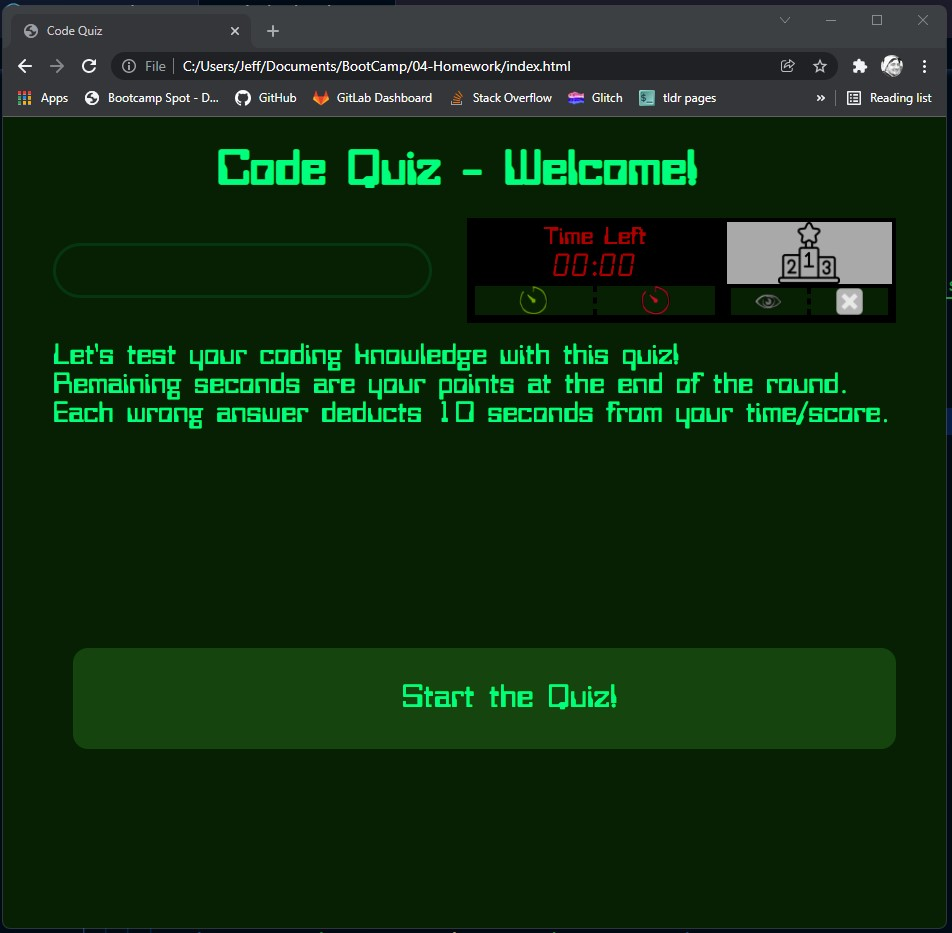
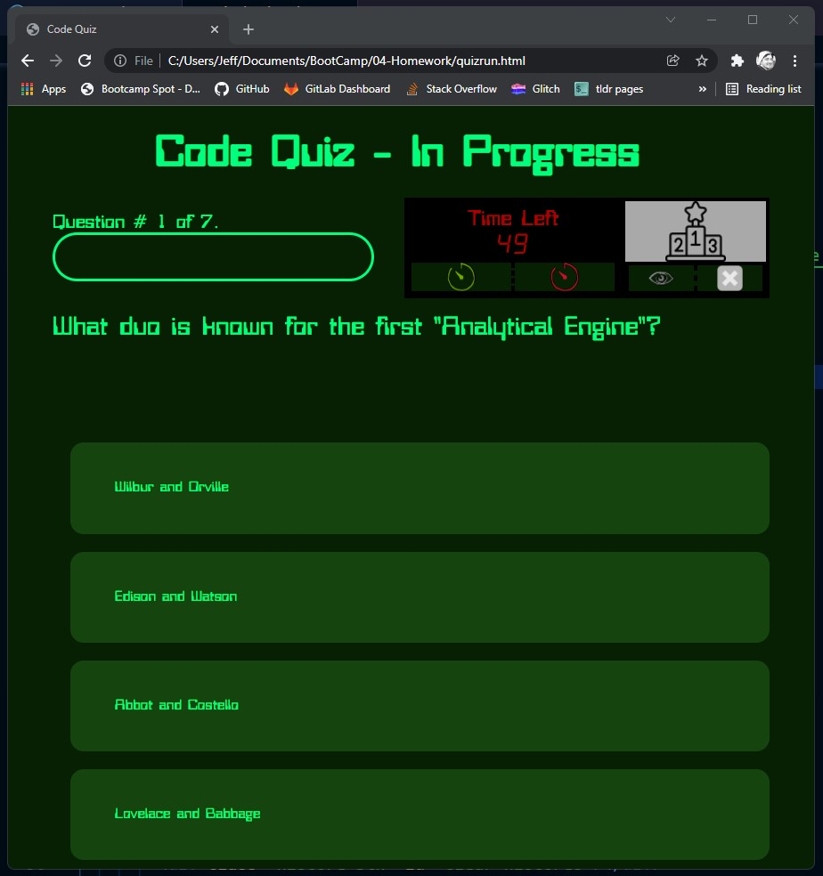
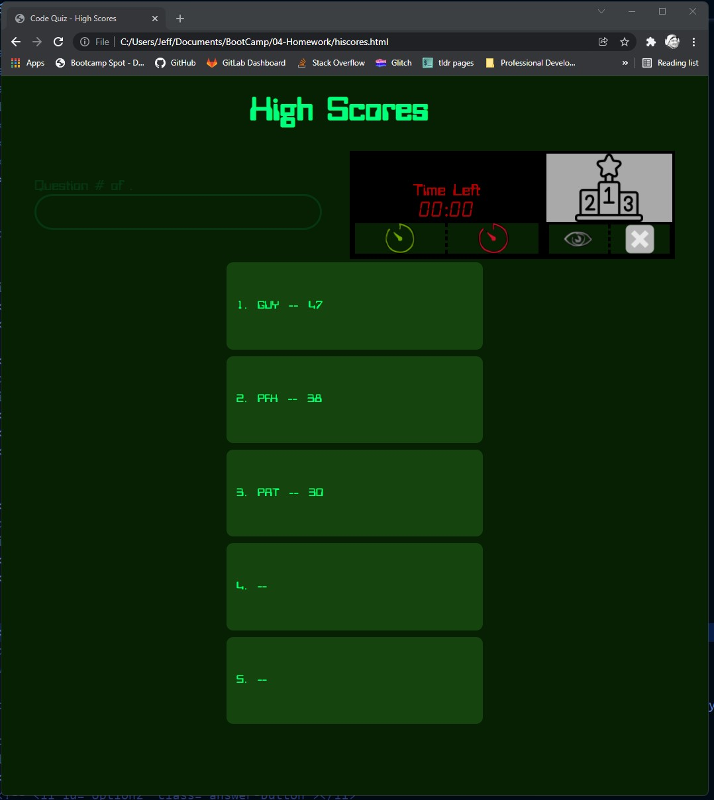
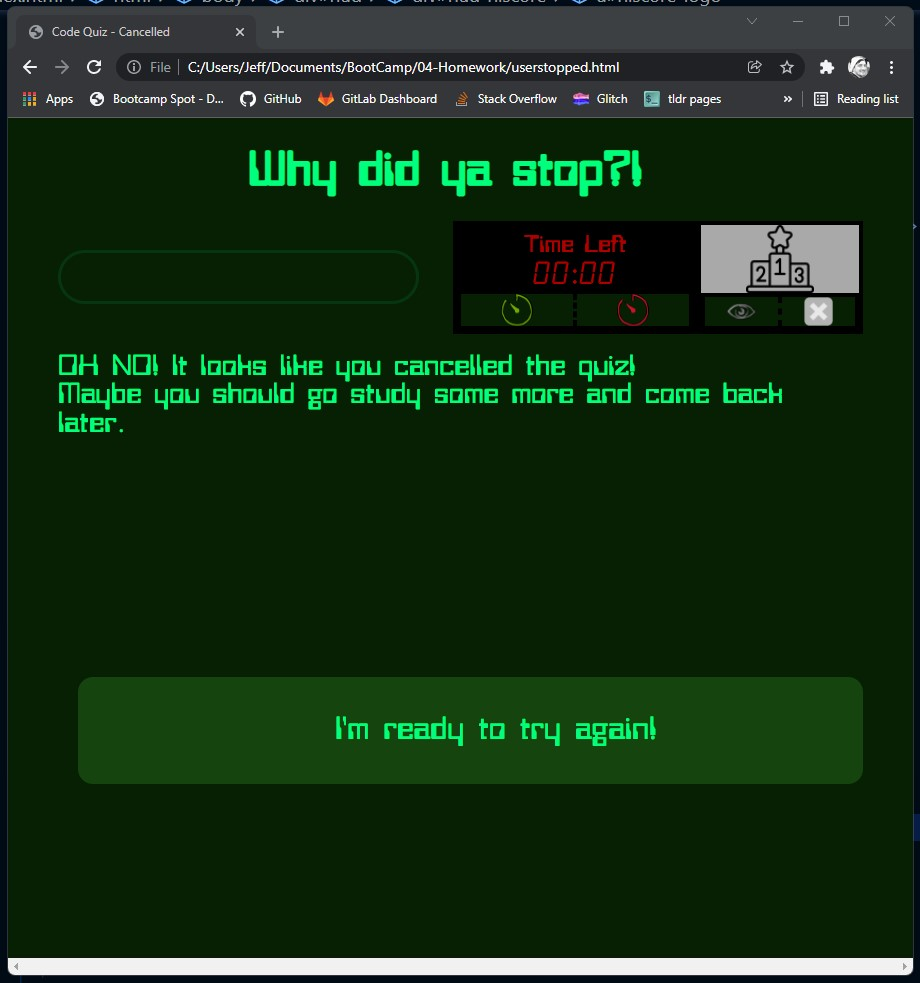

# Code Quiz
Link to the Quiz:  https://patrickfham.github.io/CodeQuiz 

## Approach
An unbelievable amount of work went into this.  I know of some who are just copying and pasting code, making it work, and hoping they can understand what it does.  I can't do that.  I do realize not all of my coding is efficient (yet, I'm learning), but it's ALL MINE.  I'm glad to sit and explain why I did each of those things, and how I could've done them differently.
Inintially, I spent a lot of time on what format to store the questions-and-answer sets.  After that was decided, the rest was build around that.
The bulk of the time was spent fumbling around with the syntax and things like that.  Some Googling, but more trial-and-error... just trying stuff.

RANDOMIZING AND SORTING... While it wasn't required, I did randomize the questions' sequence, and spent a good amount of time on understanding how that worked.  (I did not, however, randomize the answers' positions.)  Also, I sorted the high-score page, with highest score on top.  That was tricky, too.

PROGRESS ... I saw a progress-bar I liked online, and figured out how to show that using only-CSS.

RESPONSIVE ... the quiz works fine on desktop, tablet, and phones!

OUTCOMES ... there are multiple outcomes that I planned-for.  I did differentiate between "running out of time" and "getting too many wrong."

RIGHTS and WRONGS ... I chose to not-show "correct!" or "incorrect!" with each answer, for this reason:  correct advances to next question, incorrect subtracts time.  It seems obvious to me.

## Video Demos
Video #1: https://watch.screencastify.com/v/LIDsqD1NnCBsEKh3wE7F
Video #2: https://watch.screencastify.com/v/xy7MwqahoMV1xk3ilj0P

## Screenshots

